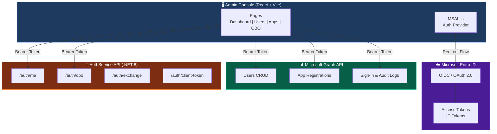
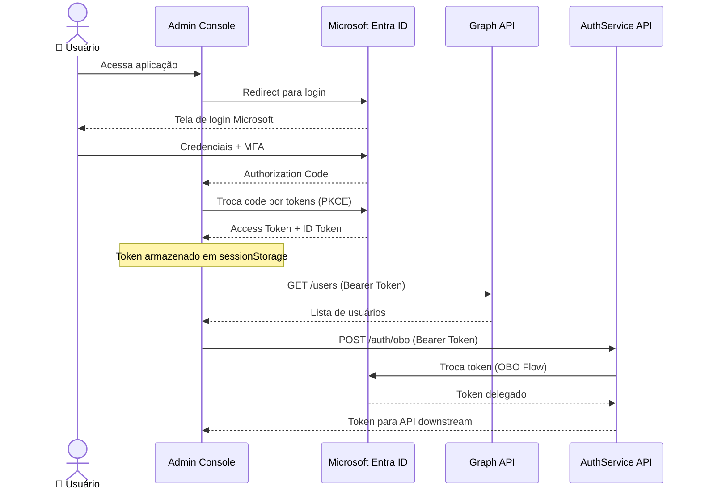
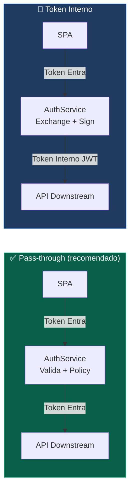

# 🎓 TFTEC Masters — App Registration Lab

**Ambiente educacional completo de Microsoft Entra ID para a TFTEC Masters.**
Frontend React + Backend .NET 8 + deploy Azure pronto. Foi feito pra você fazer fork, configurar a SUA App Registration, e brincar.

> **Para alunos:** clique em **Fork** no topo, configure sua App Reg seguindo os guias e em ~45min está rodando localmente. Se der ruim, o [Troubleshooting](#-troubleshooting) cobre 90% dos erros.

---

## 📚 Sumário

1. [O que você vai aprender](#-o-que-você-vai-aprender)
2. [Quick Start — 3 caminhos](#-quick-start--3-caminhos)
3. [Arquitetura](#-arquitetura)
4. [Setup local — passo a passo](#-setup-local--passo-a-passo)
5. [Estrutura do projeto](#-estrutura-do-projeto)
6. [Material didático](#-material-didático)
7. [Stack](#-stack)
8. [Troubleshooting](#-troubleshooting)
9. [Como contribuir](#-como-contribuir)
10. [Licença](#-licença)

---

## 🎯 O que você vai aprender

Esse repositório é o **artefato vivo** de uma aula de 2h sobre App Registrations no Microsoft Entra ID. Ao terminar, você consegue:

- ✅ Criar uma App Registration multi-tenant do zero pelo Portal Azure
- ✅ Configurar Authentication, Permissions, Client Secret e Expose API
- ✅ Implementar **MSAL.js** num SPA React (Auth Code Flow + PKCE)
- ✅ Validar JWTs no backend .NET 8 com `Microsoft.Identity.Web`
- ✅ Implementar **On-Behalf-Of (OBO)**, **Client Credentials** e **Token Exchange**
- ✅ Diferenciar Pass-through vs Token Interno (modelos de integração)
- ✅ Deploy via **GitHub Actions com OIDC** (zero secrets de longa duração)
- ✅ Debugar os erros mais comuns (`AADSTS50011`, `65001`, `7000215`, `7000229`...)

---

## 🚀 Quick Start — 3 caminhos

### Caminho 1 — "Só quero ver rodando" (5 min)

```bash
git clone https://github.com/tftec/tftec-master-app-registration.git
cd tftec-master-app-registration
npm install
npm run dev
```

Abra http://localhost:5173. **O login NÃO vai funcionar** sem App Reg sua — mas você consegue navegar pelo material do `/lab` e ver o decoder JWT, diagramas Mermaid, etc.

### Caminho 2 — "Quero replicar TUDO" (45-60 min)

Setup local funcional com SUA App Reg:

1. **Fork** este repositório no GitHub (botão `Fork` no topo direito)
2. Clone seu fork:
   ```bash
   git clone https://github.com/<seu-usuario>/tftec-master-app-registration.git
   cd tftec-master-app-registration
   ```
3. Siga **[docs/playbook/replicar-ambiente.md](docs/playbook/replicar-ambiente.md)** — guia passo a passo de 45min com:
   - Pré-requisitos (Node 20+, .NET 8 SDK)
   - Criar App Registration no Portal
   - Configurar Authentication, Permissions, Client Secret
   - Preencher `.env.local` + `appsettings.Development.json`
   - Rodar local e validar login

### Caminho 3 — "Quero deploy próprio no Azure" (90-120 min)

Caminho 2 + deploy:

1. Termine o Caminho 2 (local funcional)
2. Crie um Resource Group + App Service Plan + 2 Web Apps na sua subscription
3. Configure GitHub OIDC + Federated Credential (zero secrets de CI/CD)
4. Configure os **GitHub Secrets** + **Variables** do seu fork (lista abaixo)
5. Faça `git push` na main → workflow `.github/workflows/deploy-azure.yml` dispara

Guia completo: **[docs/guides/cicd-segmented.md](docs/guides/cicd-segmented.md)**

---

## 🏗️ Arquitetura

### Visão Geral



### Fluxo de autenticação (MSAL Redirect)



### Modelos de integração



---

## ⚙️ Setup local — passo a passo

> **Resumo rápido.** Para o guia completo com prints de Portal + troubleshooting → [docs/playbook/replicar-ambiente.md](docs/playbook/replicar-ambiente.md)

### 1. Pré-requisitos

| Ferramenta | Versão | Verificar |
|------------|--------|-----------|
| Node.js | 20.x LTS+ | `node --version` |
| .NET SDK | 8.x | `dotnet --version` |
| Git | qualquer recente | `git --version` |
| Conta Microsoft | TFTEC ou pessoal | acesso a https://portal.azure.com |

### 2. Criar a sua App Registration

Siga **[docs/guides/app-registration-setup.md](docs/guides/app-registration-setup.md)** — cobre Authentication, Permissions (User.Read, Directory.ReadWrite.All, etc.), Client Secret e Expose API. Depois copie 2 valores:

- **Application (client) ID** — algo tipo `xxxxxxxx-xxxx-xxxx-xxxx-xxxxxxxxxxxx`
- **Client Secret** — gerado em "Certificates & secrets" (copie na hora — só aparece uma vez!)

### 3. Configurar o frontend

```bash
# 1. Instalar deps
npm install

# 2. Criar .env.local com SEUS valores (copie do template)
cp .env.example .env.local

# 3. Editar .env.local — preencher com Client ID e Audience da sua App Reg
# (.env.local é gitignored — não vai pro repo)

# 4. Rodar
npm run dev
# → http://localhost:5173
```

### 4. Configurar o backend (.NET 8)

A forma mais limpa é via **User Secrets** (não vão pro repo, padrão do .NET):

```bash
cd api
dotnet user-secrets init

dotnet user-secrets set "AzureAd:ClientId"     "<seu-client-id>"
dotnet user-secrets set "AzureAd:ClientSecret" "<seu-client-secret>"
dotnet user-secrets set "AzureAd:Audience"     "api://<seu-client-id>"

# JWT signing key — gere uma chave aleatória de 32 bytes:
#   PowerShell: [Convert]::ToBase64String([System.Security.Cryptography.RandomNumberGenerator]::GetBytes(32))
#   Bash:       openssl rand -base64 32
dotnet user-secrets set "InternalJwt:SigningKey" "<chave-base64-de-32-bytes>"

dotnet run
# → http://localhost:8080
# Swagger em http://localhost:8080/swagger
```

### 5. Validar

Abra http://localhost:5173 → click **Login com Microsoft** → após login, dashboard carrega com seus dados via Graph API.

✅ Se chegou aqui, está funcionando.

❌ Se quebrou, vá pro [Troubleshooting](#-troubleshooting).

---

## 📁 Estrutura do projeto

```
tftec-master-app-registration/
├── src/                              # Frontend (React + Vite + TypeScript)
│   ├── components/                   # UI components (shadcn/ui + custom)
│   │   ├── lab/                      # Componentes do /lab interativo
│   │   └── ui/                       # shadcn/ui primitives
│   ├── config/
│   │   ├── azure.ts                  # ⚙️ Config Azure AD (lê VITE_AZURE_*)
│   │   └── msal.ts                   # MSAL configuration
│   ├── contexts/
│   │   └── AuthContext.tsx           # MSAL provider + hooks
│   ├── hooks/
│   │   ├── useGraphApi.ts            # Wrapper Microsoft Graph
│   │   └── useAuthService.ts         # Wrapper AuthService API
│   ├── pages/
│   │   ├── Index.tsx                 # Dashboard
│   │   ├── Users.tsx                 # CRUD usuários (Graph)
│   │   ├── AppRegistrations.tsx      # Gerenciar App Regs
│   │   ├── OboFlow.tsx               # On-Behalf-Of demo
│   │   ├── ClientCredentials.tsx     # Client Credentials demo
│   │   ├── TokenValidation.tsx       # Validar JWT
│   │   ├── Documentation.tsx         # Docs da API
│   │   └── lab/                      # 🧪 Laboratório interativo
│   │       ├── Hub.tsx               # /lab — entrada
│   │       ├── Demo.tsx              # Demo end-to-end com timeline
│   │       ├── Flows.tsx             # Fluxos OAuth animados
│   │       └── Tokens.tsx            # JWT decoder + anatomia
│   └── App.tsx                       # Routing
│
├── api/                              # Backend (.NET 8)
│   ├── Controllers/
│   │   ├── AuthController.cs         # /auth/me, /auth/validate
│   │   └── TokenController.cs        # /auth/exchange, /auth/obo, /auth/client-token
│   ├── Services/
│   │   ├── InternalTokenService.cs
│   │   ├── OboTokenService.cs
│   │   ├── ClientCredentialsService.cs
│   │   └── TenantValidationService.cs
│   ├── Middleware/SecurityMiddleware.cs
│   ├── Program.cs                    # Startup, JWT validation, CORS
│   ├── appsettings.json              # ⚙️ Config (use User Secrets em dev!)
│   ├── Dockerfile
│   └── docker-compose.yml
│
├── api.Tests/                        # Testes integração (xUnit)
│
├── docs/                             # 📚 Material didático completo
│   ├── aula/                         # Conteúdo da aula
│   │   ├── slides.md                 # Apresentação Marp (34 slides)
│   │   ├── perguntas-frequentes.md   # 21 FAQs reais
│   │   ├── glossario.md
│   │   ├── cheat-sheet.md
│   │   ├── lab-modules-roadmap.md
│   │   └── roadmap-avancado.md
│   ├── guides/
│   │   ├── app-registration-setup.md # 🎯 Setup App Reg passo a passo
│   │   ├── cicd-segmented.md         # CI/CD GitHub Actions + OIDC
│   │   └── repo-migration.md         # Como migrar pro seu repo
│   ├── playbook/
│   │   ├── demo-class.md             # Roteiro 2h da aula
│   │   └── replicar-ambiente.md      # 🎯 Setup completo do zero
│   ├── infrastructure/               # Roadmap APIM + Redis + Service Bus
│   ├── api/endpoints-and-flows.md    # Reference API
│   └── workshop-checklist.md         # Validação ponto a ponto
│
└── .github/
    └── workflows/
        └── deploy-azure.yml          # CI/CD Azure (OIDC, sem secrets)
```

---

## 📖 Material didático

Tudo em `docs/` está pronto pra estudo individual:

| Quero... | Leia... |
|----------|---------|
| **Roteiro da aula de 2h** | [`docs/playbook/demo-class.md`](docs/playbook/demo-class.md) |
| **Slides Marp** | [`docs/aula/slides.md`](docs/aula/slides.md) (34 slides com speaker notes) |
| **Replicar o ambiente** | [`docs/playbook/replicar-ambiente.md`](docs/playbook/replicar-ambiente.md) |
| **App Registration step-by-step** | [`docs/guides/app-registration-setup.md`](docs/guides/app-registration-setup.md) |
| **CI/CD com OIDC** | [`docs/guides/cicd-segmented.md`](docs/guides/cicd-segmented.md) |
| **FAQ — 21 perguntas reais** | [`docs/aula/perguntas-frequentes.md`](docs/aula/perguntas-frequentes.md) |
| **Glossário Entra ID** | [`docs/aula/glossario.md`](docs/aula/glossario.md) |
| **Cheat sheet** | [`docs/aula/cheat-sheet.md`](docs/aula/cheat-sheet.md) |
| **Reference da API** | [`docs/api/endpoints-and-flows.md`](docs/api/endpoints-and-flows.md) |
| **Roadmap avançado** (Conditional Access, MFA, WIF, Managed Identity) | [`docs/aula/roadmap-avancado.md`](docs/aula/roadmap-avancado.md) |

---

## 🛠️ Stack

### Frontend
| Tech | Versão | Pra quê |
|------|--------|---------|
| React | 18.3 | UI |
| TypeScript | 5.x | Tipagem |
| Vite | 5.x | Build/dev server |
| Tailwind CSS | 3.x | Styling |
| shadcn/ui | — | Component library |
| MSAL.js | 3.x | Auth Microsoft |
| TanStack Query | 5.x | Server state |
| React Router | 6.x | Routing |
| Recharts | 2.x | Gráficos do dashboard |
| Mermaid | 11.x | Diagramas no `/lab` |

### Backend
| Tech | Versão | Pra quê |
|------|--------|---------|
| .NET | 8.0 | Runtime |
| Microsoft.Identity.Web | 2.16 | JWT validation + OBO |
| MSAL.NET | 4.58 | Token acquisition |
| Swashbuckle | 6.5 | Swagger / OpenAPI |
| xUnit | latest | Testes |

---

## 🆘 Troubleshooting

Os 8 erros mais comuns. Lista completa em [`docs/aula/perguntas-frequentes.md`](docs/aula/perguntas-frequentes.md).

| Erro | Causa | Fix |
|------|-------|-----|
| `AADSTS50011 redirect_uri_mismatch` | URL não bate exato com cadastrada | Authentication → Add URI exata (case-sensitive, com/sem `/`) |
| `AADSTS65001 consent required` | Falta admin consent | API permissions → **Grant admin consent for tenant** |
| `AADSTS7000215 invalid client secret` | Secret errado/expirado | Certificates & secrets → New, atualize User Secrets |
| `AADSTS7000229` | Multi-tenant sem SP no tenant alvo | Tenant alvo precisa fazer admin consent ao menos uma vez |
| `AADSTS90002 tenant not found` | Tenant ID errado em URL | Conferir `VITE_AZURE_TENANT_ID` no `.env.local` |
| `Authorization_RequestDenied` | Permission sem consent | Grant admin consent + scopes corretos no `loginRequest` |
| `Login funciona mas dashboard vazio` | Token sem permissions | Ver Network tab → token → claims `scp` deve incluir `User.Read` etc. |
| `npm install` falha | Node antigo | Atualizar pra Node 20 LTS |
| `dotnet run` 500 | User Secrets não setados | `dotnet user-secrets list` deve mostrar `AzureAd:ClientId` etc. |
| `Erro CORS` | Frontend em porta diferente | API por default aceita `5173` e `3000`. Outras: editar `Cors:AllowedOrigins` |

### Comandos de diagnóstico

```bash
# Ver portas em uso (Windows)
netstat -ano | findstr "5173 8080"

# Limpar cache MSAL no browser
# DevTools → Application → Storage → Clear site data

# Decodificar um JWT pra ver claims
# Use https://jwt.ms/ ou a página /token-validation do app

# Ver User Secrets configurados
cd api && dotnet user-secrets list
```

### Pedir ajuda

- 📚 Docs Microsoft: https://learn.microsoft.com/entra/identity-platform/
- 💬 Issues: https://github.com/tftec/tftec-master-app-registration/issues
- 🎓 TFTEC Masters

---

## 🤝 Como contribuir

Encontrou um bug? Tem uma melhoria? Achou um erro nas docs?

1. **Issue** — abra em https://github.com/tftec/tftec-master-app-registration/issues descrevendo o problema
2. **PR** — fork → branch → fix → PR. Conventional commits (`feat:`, `fix:`, `docs:`)
3. **Discussão** — para dúvidas conceituais (não bugs), use Issues com label `question`

Antes de PR:
```bash
npm run lint          # frontend
dotnet test           # backend
```

---

## 📜 Licença

Projeto educacional — TFTEC Masters.

Use, modifique, fork à vontade pra fins educacionais. Para uso comercial, fale com a TFTEC.

---

## 🙏 Créditos

Criado pra TFTEC Masters por [Guilherme Prux Campos](https://github.com/tftec-guilherme).

Construído sobre:
- [Microsoft Identity Platform](https://learn.microsoft.com/entra/identity-platform/)
- [MSAL.js](https://github.com/AzureAD/microsoft-authentication-library-for-js) e [MSAL.NET](https://github.com/AzureAD/microsoft-authentication-library-for-dotnet)
- [shadcn/ui](https://ui.shadcn.com/) — design system
- [Lovable](https://lovable.dev/) — scaffolding inicial do frontend

---

**🎓 Boa aula!**
