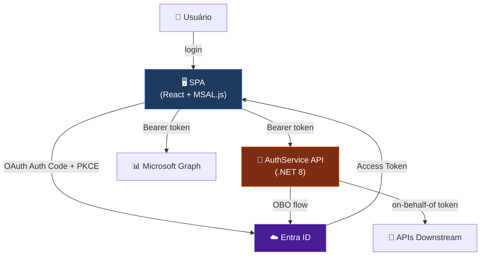
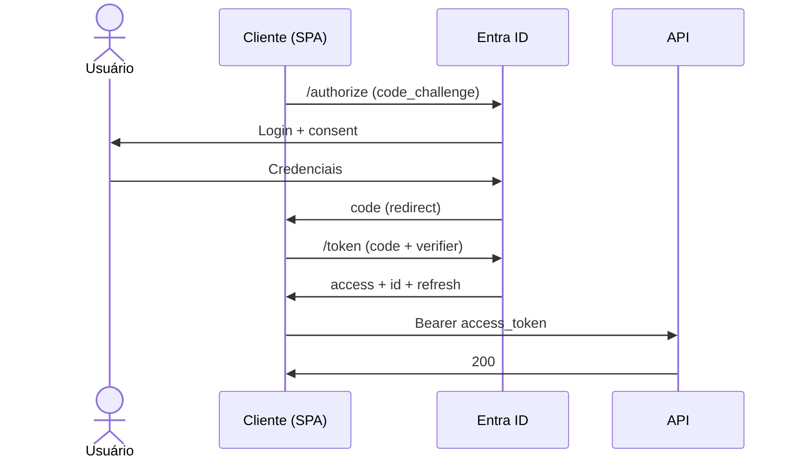

<!-- _class: lead -->

# 🔐 App Registration na prática

## Da teoria ao deploy — usando o `tftec-auth` como laboratório vivo

**TFTEC Masters** • 2026-04-29
Guilherme Campos

<!--
SPEAKER NOTES — Slide 1 (Cover, 0-30s)

Boa noite pessoal. Hoje vamos resolver um inimigo que TODO desenvolvedor que mexe com Microsoft odeia: erros AADSTS. Vou abrir com uma provocação.

TIMING: 30 segundos
TRANSITION: "Levanta a mão quem já apanhou de App Registration?"
-->

---

# 🪝 Quem aqui já viu isso?

```
AADSTS50011: The redirect URI specified in the request
does not match the redirect URIs configured for the application.
```

<!--
SPEAKER NOTES — Slide 2 (Hook, 30s-2min)

[ESPERA mãos levantando.]

PERGUNTAS PROVOCATIVAS (em sequência):
- "Quem já apanhou bonito de redirect URI mismatch?"
- "Quem nunca conseguiu fazer login Microsoft funcionar e xingou o Azure?"
- "Quem teve que pedir ajuda pro time de DevOps porque token não validava?"

TIMING: 1.5min de provocação
ENGAJAMENTO: pelo menos 70% das mãos devem subir.
TRANSITION: "Hoje vc vai sair sabendo decodificar TODOS esses erros."
-->

---

# Outros velhos conhecidos…

| Erro | Significado |
|------|-------------|
| `AADSTS65001` | User consent required |
| `AADSTS7000215` | Invalid client secret |
| `AADSTS90002` | Tenant not found |
| `Authorization_RequestDenied` | Insufficient privileges |
| `AADSTS50158` | External security challenge (MFA) |

> 🎯 Hoje vamos **decodificar todos esses erros** — e entender de onde vêm.

<!--
SPEAKER NOTES — Slide 3 (Hook expansão)

Esses 5 são 90% dos AADSTS que vc vai encontrar na carreira. Cada um tem uma causa rastreável dentro de App Registration. Ao final da aula vc diagnostica em 30 segundos.

TIMING: 1min
TRANSITION: "O que vc vai sair sabendo:"
-->

---

# O que você vai sair sabendo

✅ Criar uma App Registration do zero (multi-tenant, SPA + API)
✅ Configurar permissions, secrets, scopes, redirect URIs
✅ Decodificar JWT real e entender cada claim
✅ Trocar tokens via OBO e Client Credentials
✅ Diagnosticar AADSTS errors em segundos
✅ Saber **POR QUE** cada decisão técnica importa

> 📚 **Estrutura:** 8 cenas, 2 horas, 50% teoria + 50% mão na massa

<!--
SPEAKER NOTES — Slide 4 (Promise)

Promessa concreta. Aluno deve sentir que está bem investido nas próximas 2h.

PERGUNTA: "Antes de continuar — quem aqui já criou uma App Registration antes? E quem nunca tinha ouvido esse nome?"
[ANOTA mentalmente nível da turma. 80%+ nunca: foca mais Cena 2. Já criaram: acelera, foca Cenas 5-7.]

TIMING: 1min
TRANSITION: "Vamos ao todo: Cena 2 — Big Picture."
-->

---

<!-- _class: lead -->

# 🌍 Cena 2 — A Visão Geral

### Identidade ≠ Autenticação ≠ Autorização

<!--
SPEAKER NOTES — Cena 2 abertura (5min)

Esses 3 conceitos são confundidos por TODO mundo. Inclusive devs experientes. Vou separar com exemplos práticos.
-->

---

# Os 3 conceitos que TODO mundo confunde

| Termo | O que responde | Exemplo prático |
|-------|----------------|-----------------|
| **Identidade** | "Quem é você?" | guilherme@tftec.com.br |
| **Autenticação** | "Você é mesmo quem diz?" | senha + MFA |
| **Autorização** | "O que você pode fazer?" | role admin → pode deletar usuário |

🔑 **Microsoft Entra ID** lida com os 3.
**App Registration** é o contrato entre **sua aplicação** e o Entra ID.

<!--
SPEAKER NOTES — Slide 6 (Identity vs AuthN vs AuthZ)

NARRATIVA:
- Identidade é o sujeito (eu sou eu)
- Autenticação prova o sujeito (provei que sou eu)
- Autorização decide as ações dele (sou eu E posso deletar)

ANALOGIA: passaporte (identidade) vs alfândega (autenticação) vs visto (autorização). Cada um é uma coisa.

TIMING: 2min
TRANSITION: "App Registration — em uma frase:"
-->

---

# O que é App Registration (em uma frase)

> Uma **identidade pra sua aplicação** dentro do Microsoft Entra ID — com regras de quem pode entrar, o que pode pedir, e como vai provar quem é.

📐 **Modelo conceitual:**

```
App Registration  ─┬─→ Application Object   (template / blueprint)
                   └─→ Service Principal    (instância no tenant)
```

- **App Object** vive no tenant home (onde foi criado)
- **Service Principal (SP)** é criado em cada tenant onde o app é usado
- **Multi-tenant?** → 1 App Object + N Service Principals

<!--
SPEAKER NOTES — Slide 7 (App Object vs SP)

Ponto que confunde 90% dos devs.

ANALOGIA: classe vs objeto (em programação OOP).
- Application Object = classe (template, definição)
- Service Principal = instância (objeto rodando em cada tenant)

EXEMPLO CONCRETO:
- Slack (multi-tenant SaaS) tem 1 App Object no tenant deles
- Cada empresa que instala Slack ganha um Service Principal NO PRÓPRIO TENANT

TIMING: 2min
TRANSITION: "Vamos ver a arquitetura macro do que vamos usar hoje."
-->

---

# Arquitetura macro do `tftec-auth`



<!--
SPEAKER NOTES — Slide 8 (Architecture)

3 atores: SPA, Entra ID, API Backend. Está em TODA aplicação corporativa Microsoft que vc tocar nos próximos 10 anos.

PONTOS:
- Setas indicam fluxo de tokens
- OBO (verde) = API troca token preservando user identity
- Auth Code + PKCE (azul) = login do user
- Bearer token (laranja) = autorização da request

TIMING: 2min
TRANSITION: "Quem precisa de App Registration nessa arquitetura?"
-->

---

# Quem precisa de App Registration?

| Ator | Precisa? | Por quê |
|------|----------|---------|
| 🖥️ SPA (frontend) | ✅ Sim | Pra fazer login do usuário |
| 🔐 API backend | ✅ Sim | Pra validar tokens E pedir tokens (OBO) |
| 🤖 Worker/Daemon | ✅ Sim | Pra autenticar sem usuário (Client Credentials) |
| 🔁 CI/CD | ✅ Sim | Service Principal pra deploy automatizado |

> Geralmente **1 App Registration por aplicação lógica** (ver "Pattern A vs B" mais à frente)

<!--
SPEAKER NOTES — Slide 9 (Quem precisa)

CADA ATOR é uma identidade no Entra ID.

EXEMPLO TFTEC:
- App Reg "tftec-auth" → cobre SPA + API (Pattern A)
- App Reg "sp-tftec-authsvc-cicd-001" → CI/CD via OIDC

PERGUNTA PRA TURMA:
"Alguém usa Service Principal pra deploy automatizado? Quem usa GitHub Actions?"

TIMING: 1.5min
TRANSITION: "Vamos pra cena prática — vou criar uma App Reg ao vivo."
-->

---

<!-- _class: lead -->

# ✨ Cena 3 — First Aha
### LIVE DEMO: criar `AUTH_AULA_DEMO` em 3 minutos

⚠️ Vc só observa agora. **Não mexa ainda.**

<!--
SPEAKER NOTES — Cena 3 abertura

CRÍTICO: Aluno NÃO mexe agora. Apenas observa e absorve.
Vou criar UMA App Reg do zero ao vivo, narrando cada campo.
Cronometra — não pode passar de 10min.

PRÉ-REQUISITO: Portal Azure aberto, login admin, browser pronto.
-->

---

# Os 7 campos que importam

| # | Campo | Decisão crítica |
|---|-------|------------------|
| 1 | **Name** | Cosmético, vira display name em consents |
| 2 | **Supported account types** | 🚨 **Quase impossível trocar depois** — pense bem |
| 3 | **Redirect URI (platform)** | SPA vs Web vs Public — escolha errada = login não funciona |
| 4 | **Redirect URI (value)** | Match EXATO com URL do app |
| 5 | **Application (client) ID** | UUID gerado, vira `clientId` no código |
| 6 | **Directory (tenant) ID** | Identifica seu tenant no Entra ID |
| 7 | **Application ID URI** | Pra expor sua API: `api://{client-id}` |

<!--
SPEAKER NOTES — Slide 11 (7 campos)

Estes 7 são tudo que importa. Vou preencher AO VIVO no Portal e explicar cada um na hora.

CAMPO QUE MAIS DÁ ERRO:
- #2 Account types: trocar single→multi DEPOIS quebra tokens cached
- #3 Platform: SPA pra MSAL.js (PKCE), Web pra server-side (com client_secret)
- #4 Redirect URI: trailing slash, http vs https, port — match EXATO

TIMING: 2min explicação
TRANSITION: "Decisão #2 é a mais importante:"
-->

---

# Decisão crítica: Account types

| Opção | Audiência | Quando usar |
|-------|-----------|-------------|
| Single tenant | Só sua org | Apps internos |
| **Multi-tenant** ⭐ | Qualquer org Entra ID | SaaS B2B (caso TFTEC) |
| Multi + personal | Org + Microsoft pessoal (Xbox/Skype) | Apps mistos |
| Personal only | Só Xbox/Skype | Apps consumer |

⚠️ **Trocar depois pode quebrar tokens cached, redirect URIs e Audience claim.** Decida no day 1.

<!--
SPEAKER NOTES — Slide 12 (Account types)

CONFISSÃO PESSOAL:
"Eu já apanhei 2x trocando isso depois. Erro de iniciante. Pensa bem antes."

CASO TFTEC: usamos Multi-tenant (SaaS B2B típico).

PERGUNTA TRAP:
"E se eu quiser SPA + login com Gmail?"
RESPOSTA: "Aí é B2C — produto SEPARADO. Nunca confunda Multi-tenant Entra ID com B2C."

TIMING: 1.5min
TRANSITION: "Vamos lá — Portal aberto, executando."
-->

---

<!-- _class: lead -->

# 🎬 [LIVE DEMO]

## Portal Azure → Microsoft Entra ID → App registrations
## + New registration

⏱️ **3 minutos** — vou narrando cada campo.

<!--
SPEAKER NOTES — Slide 13 (LIVE DEMO marker)

EXECUÇÃO PORTAL:
1. Portal → Microsoft Entra ID → App registrations → + New registration
2. Name: AUTH_AULA_DEMO_2026-04-29
3. Account types: Multi-tenant
4. Redirect URI: SPA + http://localhost:5173
5. Click Register

Após criar, mostrar Overview:
- Application (client) ID — "vai no código como clientId"
- Directory (tenant) ID — "identifica seu tenant"
- Click Endpoints — mostrar OAuth endpoints

PERGUNTA:
"Algum aluno consegue me dizer pra que serve cada endpoint só pelo nome?"

TIMING: 3-5min total
TRANSITION: "Sua vez!"
-->

---

<!-- _class: lead -->

# 🛠️ Cena 4 — Sua vez!
### Lab 1: Criar `AUTH_<seu-nome>`

⏱️ **25 minutos.** Eu fico circulando. Travou? Levanta a mão.

📋 Material: `docs/guides/app-registration-setup.md` no repo

<!--
SPEAKER NOTES — Cena 4 abertura

ALUNOS FAZEM AGORA. Eu circulo, ajudo travados.

CHECKPOINTS DURANTE LAB:
- 5min: "Pessoal, depois de Register, NÃO esqueçam de copiar Client ID e Tenant ID."
- 10min: "Em Authentication, lembrem que Web e SPA são plataformas DIFERENTES. Use SPA pra MSAL.js."
- 15min: "Em API permissions, depois de adicionar todas, clica em 'Grant admin consent for TFTEC' — botão verde."
- 20min: "Em Client secret, copia o VALUE imediatamente. Se vc fechar a página, ele some."
- 25min: "Termina aí, pessoal."

VALIDAÇÃO: cada aluno preenche tabela com Client ID + Tenant ID + Audience URI no quadro.
-->

---

# Lab 1 — Checklist (25min)

- [ ] **§1 Criar registration** — Name, Multi-tenant, SPA + `http://localhost:5173`
- [ ] **§2 Authentication** — adicionar 2ª URI: `https://authservice-front-tftec.azurewebsites.net`
- [ ] **§3 API Permissions** — Microsoft Graph (Delegated):
  - `User.Read`, `User.ReadWrite.All`, `Directory.ReadWrite.All`
  - `Application.Read.All`, `Application.ReadWrite.All`, `AuditLog.Read.All`
- [ ] **Grant admin consent** — botão verde, status `✅ Granted for TFTEC`
- [ ] **§4 Client Secret** — duração 12 meses, **COPIAR VALUE IMEDIATAMENTE**
- [ ] **§5 Expose API** — `api://{seu-client-id}` + scope `access_as_user`

🎯 **Validação final:** preencher tabela
| Campo | Seu valor |
|-------|-----------|
| Client ID | _______ |
| Tenant ID | _______ |
| Audience URI | _______ |

<!--
SPEAKER NOTES — Slide 15 (Lab 1 checklist)

Esses são os 5 passos do guide app-registration-setup.md.

PROBLEMAS QUE VÃO APARECER:
- Aluno esquece Multi-tenant → vou ter que ajudar trocar (perigoso!)
- Aluno copia secret errado → criar outro
- Aluno não dá Admin Consent → erro depois "Authorization_RequestDenied"

TIMING: lab roda 25min
TRANSITION: "Validação concluída? Vamos pra teoria — Cena 5."
-->

---

<!-- _class: lead -->

# 🔬 Cena 5 — Deep Dive Teórico
### Como OAuth 2.0 + PKCE realmente funciona

🆕 Vamos usar o `/lab/*` do `tftec-auth` em vez de slides estáticos!

<!--
SPEAKER NOTES — Cena 5 abertura

MUDANÇA: Em vez de slides com Mermaid estático, vou abrir o /lab/fluxos do tftec-auth — tem SequencePlayer animado, MUITO mais didático.

URL: https://authservice-front-tftec.azurewebsites.net/lab/fluxos
-->

---

# OAuth 2.0 Authorization Code Flow + PKCE

🌐 **Demo ao vivo:** abre `https://authservice-front-tftec.azurewebsites.net/lab/fluxos` → tab **Auth Code + PKCE** → click ▶ Reproduzir



<!--
SPEAKER NOTES — Slide 17 (Auth Code + PKCE)

ABRE /lab/fluxos NO PROJETOR e click ▶.

NARRA STEP-BY-STEP enquanto anima:
1. Início: SPA detecta sessão ausente
2. /authorize: gera code_challenge = SHA256(code_verifier random)
3. Tela de login: hospedada pela Microsoft
4. User autentica: senha + MFA
5. Code retorna: single-use, expira ~10min
6. /token: SPA envia o verifier ORIGINAL
7. Entra valida: SHA256(verifier) == challenge guardado?
8. Tokens emitidos: id_token + access + refresh
9. Bearer: chamada API
10. API valida JWT contra JWKS público

CHAVE: PKCE protege MESMO se alguém intercepta o code.

TIMING: 5-7min explicação + animação
TRANSITION: "Por que PKCE?"
-->

---

# Por que PKCE? (Proof Key for Code Exchange)

❌ **Sem PKCE** (Implicit Flow legado):
- Token vai pela URL → fica em browser history, logs, referer header

✅ **Com PKCE:**
1. SPA gera `code_verifier` random local (43-128 chars)
2. SPA envia `code_challenge = SHA256(verifier)` no /authorize
3. Entra ID guarda o challenge
4. SPA pede token enviando o `verifier` original
5. Entra ID compara `SHA256(verifier) == challenge` → liga apenas se igual

🔒 **Resultado:** mesmo se alguém interceptar o `code`, não consegue trocar por token sem o `verifier` que está SÓ no browser do usuário.

> 💡 **PKCE é OBRIGATÓRIO pra SPA desde OAuth 2.1.**

<!--
SPEAKER NOTES — Slide 18 (Por que PKCE)

MENCIONA:
- Implicit Flow está deprecated. Não use NUNCA em apps novos.
- PKCE = Public Key (no fundo é hash) Code Exchange
- Mesmo conceito de "comprovação posterior": só QUEM gerou o code_verifier consegue completar a troca

PERGUNTA:
"Qual a diferença pro user no UX?"
RESPOSTA: "Nenhuma! Mesmo login. Mas no fundo o protocolo mudou completamente."

TIMING: 3min
TRANSITION: "Agora vamos VER um JWT real."
-->

---

# Anatomia de um JWT real

🌐 **Demo ao vivo:** abre `/lab/tokens` → tab **Decoder** → cola token de DevTools → vê estrutura

```
eyJ0eXAiOiJKV1QiLCJhbGciOiJSUzI1NiIs...   .   eyJhdWQiOiJhcGk6Ly83ODM0NTI5MS0...   .   abc123signature
       ┌─────────┐                        ┌──────────────┐                        ┌────────┐
       │ Header  │                        │   Payload    │                        │   Sig  │
       └─────────┘                        └──────────────┘                        └────────┘
```

3 partes separadas por `.`:
1. **Header** — `{"typ":"JWT","alg":"RS256","kid":"..."}`
2. **Payload** — claims (próximo slide)
3. **Signature** — `RSA(SHA256(header.payload), private_key)`

<!--
SPEAKER NOTES — Slide 19 (JWT anatomy)

ABRE /lab/tokens TAB DECODER no projetor.

PEGA UM TOKEN REAL:
- Outra aba: https://authservice-front-tftec.azurewebsites.net/
- Login Microsoft
- DevTools → Application → SessionStorage
- Procura msal.token.keys.<client-id>
- Copia access_token
- Cola em /lab/tokens Decoder

NARRA enquanto mostra:
- Header: alg=RS256 (assimétrico)
- Payload: claims (next slide detalha)
- Signature: assinatura RSA — só Entra ID com private key consegue gerar

ATENÇÃO: payload é só Base64URL-encoded, NÃO criptografado. Decode = público.

TIMING: 3min
TRANSITION: "Claims importantes:"
-->

---

# Claims importantes (payload)

| Claim | Significa | Validação |
|-------|-----------|-----------|
| `iss` | Issuer | ✅ Sempre |
| `aud` | Audience (pra QUEM o token foi emitido) | ✅ Sempre |
| `exp` | Expiry (Unix timestamp) | ✅ Sempre |
| `nbf` | Not Before | ✅ Sempre |
| `sub` | Subject (ID único user, sem PII) | Identificação |
| `oid` | Object ID (ID user no diretório) | Multi-tenant |
| `tid` | Tenant ID (de qual tenant veio) | ✅ Multi-tenant |
| `scp` | Scopes (delegated permissions) | Authorization |
| `roles` | App roles (application permissions) | Authorization |

🚨 **Validação SEMPRE checa: `iss`, `aud`, `exp`, `signature`. Pular qualquer um = vulnerabilidade.**

<!--
SPEAKER NOTES — Slide 20 (Claims)

CHAVE:
- aud é a primeira coisa que API valida. Token Graph não vale pra sua API.
- iss precisa bater com Entra ID + tenant. Anti-spoofing.
- scp vs roles: vc explica diferença em FAQ #14

PERGUNTA:
"Se alguém criasse uma App Reg single-tenant e tentasse logar com user de outro tenant, qual claim retornaria diferente?"
RESPOSTA: "tid mostraria tenant errado. Validação custom rejeitaria com AADSTS50020 antes de emitir."

TIMING: 4min
TRANSITION: "Multi-tenant na prática:"
-->

---

# Multi-tenant na prática

```json
{
  "aud": "api://78345291-2586-4691-b1f9-e4e780f55328",
  "iss": "https://login.microsoftonline.com/<TENANT_DO_USUÁRIO>/v2.0",
  "tid": "<TENANT_DO_USUÁRIO>",  // ← NÃO é o seu tenant!
  ...
}
```

⚙️ Sua API multi-tenant deve:
- ✅ Aceitar `tid` de qualquer tenant (`AllowAllTenants: true`)
- ❌ OU restringir lista (`AllowedTenants.TenantIds: ["...","..."]`)
- ✅ Validar `iss` corresponde ao `tid` (anti-spoofing)
- ✅ Validar audience exata (não aceita `api://*`)

> 🎯 No `tftec-auth/api/appsettings.json` veja a config `AllowedTenants` em ação.
> No `Program.cs` linhas 65-77, o middleware valida tenant.

<!--
SPEAKER NOTES — Slide 21 (Multi-tenant na prática)

MOSTRA NO CÓDIGO:
"Vou abrir agora o api/Program.cs no GitHub e mostrar o middleware OnTokenValidated que checa tid."

CÓDIGO REAL:
```csharp
options.Events.OnTokenValidated = context => {
  var tid = context.Principal?.FindFirst("tid")?.Value;
  if (!tenantService.IsTenantAllowed(tid)) {
    context.Fail("Tenant not allowed");
  }
};
```

TIMING: 3min
TRANSITION: "Cena 6 — sua vez de chamar API real."
-->

---

<!-- _class: lead -->

# 🚀 Cena 6 — Hands-On Lab 2
### Integrar com `tftec-auth` via `/lab/demo`

🌐 `https://authservice-front-tftec.azurewebsites.net/lab/demo`

<!--
SPEAKER NOTES — Cena 6 abertura

DEMO INTERATIVA: SequencePlayer + EventTimeline + botão "Executar de verdade"
3 cenários: spa-login-api, obo, client-credentials, saml (informativo)

VALOR PEDAGÓGICO: aluno vê REQUEST/RESPONSE real ao vivo, não simulação.
-->

---

# Os 3 fluxos OAuth essenciais

| Flow | Quem usa | Quando |
|------|---------|--------|
| **Authorization Code + PKCE** | Frontend com user logado | Login normal de SPA/web app |
| **On-Behalf-Of (OBO)** | Backend que precisa chamar OUTRA API em nome do user | API → API com identidade preservada |
| **Client Credentials** | Worker/cron sem user (m2m) | Job que sincroniza dados, sem identidade humana |

🎯 **No `tftec-auth` os 3 estão implementados:**
- `/auth/me` → Auth Code (validação de token)
- `/auth/obo` → OBO flow
- `/auth/client-token` → Client Credentials

> 🌐 **Demo:** `/lab/demo` automatiza chamadas + mostra timeline ao vivo

<!--
SPEAKER NOTES — Slide 23 (3 flows)

NO /lab/demo executa cada um:

1. spa-login-api: pega token do user → chama Graph /me → mostra displayName
2. obo: API troca token preservando identidade → token2 pra Graph
3. client-credentials: token de aplicação SEM user (roles claim, não scp)

DIFERENÇA AUDITORIA:
- OBO: log mostra appid + oid (user)
- Client Credentials: log mostra só appid (sem identidade humana)

Isso É IMPORTANTE pra forensics e compliance.

TIMING: 2min explicação + 5min hands-on lab
TRANSITION: "Sua vez — explora /lab/demo."
-->

---

# Lab 2 — Hands-On (15min)

> 🎯 No browser: `/lab/demo`

**Tarefas:**
1. Login no `tftec-auth`
2. Vai pra `/lab/demo`
3. Roda 3 cenários (spa-login, obo, client-credentials)
4. Click ▶ Reproduzir + **Executar de verdade**
5. Compara timeline de cada um

**Bonus:** vai pra `/validate` → "Pegar token via MSAL" → comparar token AuthService vs Graph → veja diferença de `aud`

<!--
SPEAKER NOTES — Slide 24 (Lab 2 hands-on)

TIMING: 15min lab
EU CIRCULO durante o lab.

CHECKPOINTS:
- 5min: "Quem viu erro 401? Aud do token bate com api://78345291...?"
- 10min: "Diferença scp (delegated) vs roles (application) ficou clara?"
- 13min: "Pegou 2 tokens em /validate? Compara aud — DIFERENTES."

VALOR: aluno entende NA PRÁTICA que tokens não são intercambiáveis.
-->

---

<!-- _class: lead -->

# 🔧 Cena 7 — Quebrando de propósito
### Diagnóstico de 5 erros AADSTS ao vivo

<!--
SPEAKER NOTES — Cena 7 abertura

CENA MAIS DIVERTIDA. Vou QUEBRAR de propósito e a turma diagnostica ANTES de eu mostrar o erro.

PRÉ-REQUISITO: Tenho App Reg DEMO da Cena 3 ainda viva.
Backup: branch aula/erros-deliberados (se eu tiver criado).
-->

---

# Os 5 erros que você vai encontrar de novo na vida

| Erro | Causa | Onde olhar primeiro |
|------|-------|---------------------|
| `AADSTS50011` | Redirect URI não match | Authentication → Redirect URIs |
| `AADSTS65001` | User consent missing | API permissions → Grant admin |
| `AADSTS7000215` | Client secret errado/expirado | Certificates & secrets |
| `AADSTS90002` | Tenant ID errado | URL `/oauth2/v2.0/token` |
| `Authorization_RequestDenied` | Permission sem admin consent | API permissions tab |

🎬 **AGORA:** vou pegar o `tftec-auth` e quebrar UMA configuração de cada vez. **Vc me diz qual erro vai acontecer ANTES de eu rodar.**

<!--
SPEAKER NOTES — Slide 26 (5 erros)

DEMO COMPETITIVA:
Cada quebra → eu pergunto "qual erro vai dar?" → turma responde → eu testo no browser.

DEMO 1 (AADSTS50011): Mudo redirect URI pra http://localhost:9999 → tento login → erro 50011
DEMO 2 (AADSTS65001): Revogo admin consent → user novo loga → erro 65001
DEMO 3 (AADSTS7000215): Mudo 1 char no secret no Postman → 7000215
DEMO 4 (Audience mismatch): Pego token Graph, chamo API → 401 audience
DEMO 5 (AADSTS90002): URL com tenant errado → 90002

PRÊMIO simbólico pra quem acertar antes (pode ser café, sticker).

TIMING: 12min
TRANSITION: "Metodologia de debug em 5 perguntas:"
-->

---

# Metodologia de debug — 5 perguntas em ordem

1. **Qual o erro EXATO?** (não "não funciona" — copia o `AADSTS_____`)
2. **Em qual etapa do flow?** (login? troca de token? chamada API?)
3. **O token é válido?** (cole em `/lab/tokens` Decoder ou jwt.ms)
4. **A configuração do App Reg bate com o código?**
5. **Existe admin consent?** (90% dos casos misteriosos)

> 💡 **Dica de ouro:** quando achar que o problema é no código, é configuração. Quando achar que é configuração, é o código. Sempre o oposto da sua primeira intuição.

<!--
SPEAKER NOTES — Slide 27 (Metodologia debug)

MEMORIZE estas 5. 95% dos AADSTS cabem nelas.

CASE STORY (se tiver tempo):
"Já passei 2 dias debugando uma falha que era um trailing slash em redirect URI. Aprendi a perguntar 'a config bate com o código?' como segunda pergunta sempre."

TIMING: 2min
TRANSITION: "Última cena — recap e próximos passos."
-->

---

<!-- _class: lead -->

# 🎯 Cena 8 — Synthesis & Roadmap

<!--
SPEAKER NOTES — Cena 8 abertura

ÚLTIMA CENA: 15min recap + Q&A.
-->

---

# Recap por Bloom — o que você consegue agora

| Nível Bloom | Você consegue |
|-------|---------------------|
| 1. Lembrar | Definir App Reg, SP, JWT, claims, scopes |
| 2. Compreender | Explicar OAuth Auth Code + PKCE com palavras próprias |
| 3. Aplicar | Criar App Reg do zero (Lab 1 ✅) |
| 4. Analisar | Decodificar JWT e identificar problema (Decoder ✅) |
| 5. Avaliar | Decidir Web vs SPA, OBO vs Client Credentials |
| 6. Criar | Integrar app próprio com Entra ID (Lab 2 ✅) |

> 🎓 Em 2 horas vc atravessou os 6 níveis cognitivos. **Vc sabe MAIS de Entra ID que 80% dos devs que tocam isso.**

<!--
SPEAKER NOTES — Slide 29 (Recap Bloom)

VALIDAÇÃO PEDAGÓGICA:
A taxonomia Bloom mostra que aluno passou de nada → criar.

PERGUNTA DE ENTREVISTA:
"Imagina vc na entrevista pra Senior Dev. Pergunta: 'Como vc explicaria App Registration pra alguém de negócio?' Vc consegue?"

(Espera resposta da turma. Se sim → confirmou aprendizado.)

TIMING: 2min
TRANSITION: "Pra onde ir agora?"
-->

---

# Pattern A vs Pattern B — Quantos App Regs?

```
Pattern A (atual tftec-auth):              Pattern B (clássico SaaS):
┌───────────────────────────┐               ┌──────────────┐  ┌──────────────┐
│ App Reg: tftec-auth       │               │ App Reg: SPA │  │ App Reg: API │
│   ├─ SPA (mesmo client_id)│               │  client_id=A │─▶│ audience=B   │
│   └─ API (aud=api://...)  │               └──────────────┘  └──────────────┘
└───────────────────────────┘
```

| Quando A | Quando B |
|----------|----------|
| MVP/demo/educacional | SaaS multi-cliente |
| 1 SPA + 1 API próprios | API consumida por OUTROS apps |
| Mesma equipe gerencia | Releases independentes |
| Compliance simples | Compliance exige segregação |

> 💡 **Pergunta de entrevista:** *"Você usaria 1 ou 2 App Registrations pra X?"*
> **Resposta certa:** *"Depende. Quantos clients consomem a API? Equipes diferentes? Compliance?"*

<!--
SPEAKER NOTES — Slide 30 (Pattern A vs B)

ESSE SLIDE FOI ADICIONADO POR DEMANDA DA TURMA — vai ser bombardeado.

PONTO CHAVE: Não existe certo absoluto. Decisão arquitetural depende de contexto.

EXEMPLOS PRA CITAR:
- Slack desktop: Pattern B (cada cliente tem app id próprio que consome API Slack pública)
- Sua app interna: Pattern A se SPA+API são acoplados
- Microsoft Teams: Pattern B porque Teams API consumida por Outlook, Word, etc.

TIMING: 3min
TRANSITION: "Próximos tópicos pra dominar:"
-->

---

# Roadmap próximos tópicos

| # | Tópico | Por quê |
|---|--------|---------|
| 1 | **Conditional Access** | Bloquear login fora de horário/IP/device |
| 2 | **MFA & Authentication Methods Policy** | TOTP, FIDO2, passkeys |
| 3 | **Workload Identity Federation (OIDC)** | Eliminar client secrets em CI/CD ⭐ já no `tftec-auth`! |
| 4 | **Managed Identity** | App Reg automática no Azure (zero secret) |
| 5 | **Certificate-based Auth** | Substituir client_secret por certificado |
| 6 | **Custom Claims & Claim Mapping Policy** | Adicionar claims do RH no JWT |
| 7 | **App Roles vs Groups vs Scopes** | Modelos de autorização |
| 8 | **B2B vs B2C** | Quando usar cada um |

📚 Detalhe: `docs/aula/roadmap-avancado.md`

<!--
SPEAKER NOTES — Slide 31 (Roadmap)

DESTAQUE: #3 (Workload Identity Federation) já é usado neste repo pra deploy GitHub Actions sem client secret. Promessa de próximo workshop.

TIMING: 2min
TRANSITION: "Materiais pra levar:"
-->

---

# 🎁 Materiais pra você levar

📦 Repositório: **https://github.com/tftec-guilherme/entra-auth-gateway**

| Arquivo | Pra quê |
|---------|---------|
| `docs/aula/slides.md` | Estes slides (Marp) |
| `docs/aula/glossario.md` | 50+ termos definidos |
| `docs/aula/cheat-sheet.md` | 1-pager pra grudar no monitor |
| `docs/aula/roadmap-avancado.md` | Próximos passos |
| `docs/aula/perguntas-frequentes.md` | FAQ — 21 perguntas técnicas |
| `docs/aula/lab-modules-roadmap.md` | Status dos 8 módulos do `/lab` |
| `docs/playbook/replicar-ambiente.md` | **Recriar ambiente do zero** ⭐ |
| `docs/playbook/demo-class.md` | Roteiro completo desta aula |
| `docs/review/security-audit.md` | Auditoria do sistema |
| `docs/review/code-review-frontend.md` | Review do frontend |
| `docs/api/endpoints-and-flows.md` | Documentação API |

<!--
SPEAKER NOTES — Slide 32 (Materiais)

DESTAQUE: replicar-ambiente.md é o que mais vão usar pós-aula.

CTA: "Fork o repo. Faz o lab. PR welcome — você pode contribuir com novos módulos do /lab."

TIMING: 1min
TRANSITION: "Q&A!"
-->

---

<!-- _class: lead -->

# 🙋 Q&A
## Quais foram suas dores hoje? Quais ainda têm?

📚 Apoio: `docs/aula/perguntas-frequentes.md` no repo

**Próxima aula:** Conditional Access (data TBD)

<!--
SPEAKER NOTES — Slide 33 (Q&A)

PREPARAÇÃO: tenho FAQ aberto na 2ª tela.

Se aluno faz pergunta que está no FAQ:
- Responde de cabeça (eu li ele!)
- Aponta o doc pra estudo posterior

Se aluno faz pergunta NOVA (fora do FAQ):
- Resposta honesta: "Vou checar e respondo no Slack/canal."
- Anota num post-it
- Adiciona ao FAQ pós-aula

NÃO IMPROVISA. Honestidade técnica > parecer onisciente.

TIMING: 5-10min Q&A
TRANSITION: "Encerramento."
-->

---

<!-- _class: lead -->

# Obrigado! 🎓

**guilherme.campos@tftec.com.br**

🐙 github.com/tftec-guilherme/entra-auth-gateway
🔗 https://authservice-front-tftec.azurewebsites.net

> "App Registration é configuração — depois que vc entende a lógica, é só preencher campo certo no lugar certo."

<!--
SPEAKER NOTES — Slide 34 (Closing)

ENCERRAMENTO ENERGIZANTE.

PEDIDO FINAL: "Quem quer ser avisado da próxima aula (Conditional Access), manda mensagem ou estrelh o repo no GitHub."

ACENO: agradece presença + boa noite.

TIMING: 30s
-->
