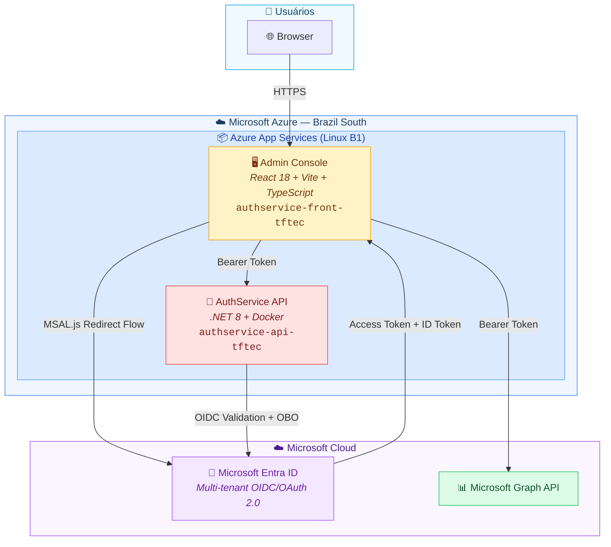
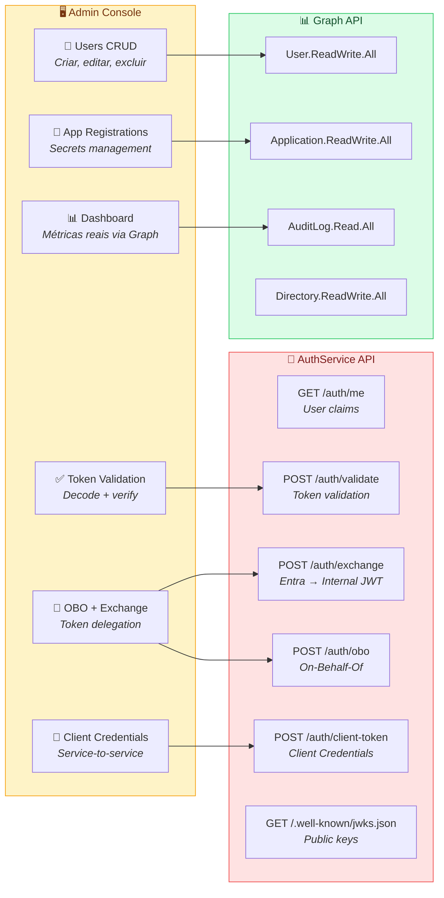
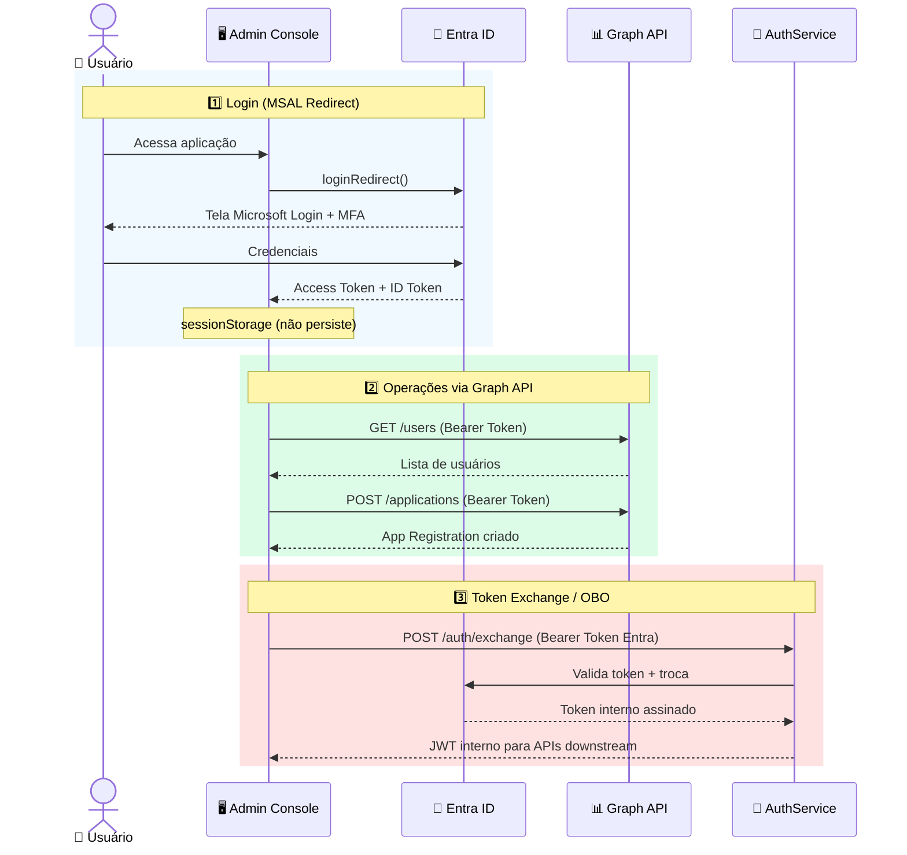
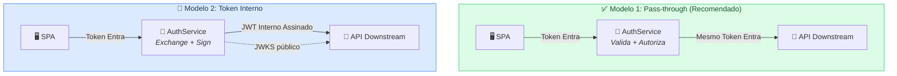
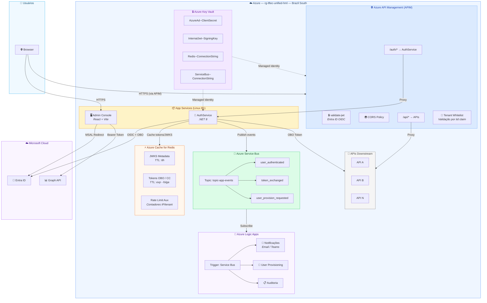

# 🏗️ Diagrama de Infraestrutura — AuthService & Admin Console

> Visão completa da arquitetura atual e evolução v1 (APIM + Redis + Service Bus + Logic Apps)

---

## 1. Arquitetura Atual (Produção)

---

## 2. O que cada componente faz

---

## 3. Fluxo de Autenticação (Passo a Passo)

---

## 4. Modelos de Integração com APIs Downstream

---

## 5. CI/CD Pipeline (GitHub Actions)

```mermaid
graph LR
    subgraph Dev["👨‍💻 Desenvolvimento"]
        Code["📝 Código"] -->|"git push main"| GH["🐙 GitHub"]
    end

    subgraph Pipeline["⚙️ GitHub Actions"]
        direction TB
        GH -->|"Trigger"| Infra["1️⃣ Provisionar Infra<br/><i>RG + App Service Plan</i>"]
        Infra --> BuildAPI["2️⃣ Build API<br/><i>dotnet publish</i>"]
        Infra --> BuildFront["2️⃣ Build Frontend<br/><i>npm run build</i>"]
        BuildAPI --> DeployAPI["3️⃣ Deploy API<br/><i>App Service</i>"]
        BuildFront --> DeployFront["3️⃣ Deploy Frontend<br/><i>App Service</i>"]
        DeployAPI --> Health["4️⃣ Health Check<br/><i>GET /health</i>"]
    end

    subgraph Secrets["🔒 GitHub Secrets"]
        S1["AZURE_SP_CLIENT_ID"]
        S2["AZURE_SP_CLIENT_SECRET"]
        S3["AZURE_SP_TENANT_ID"]
        S4["AZURE_SUBSCRIPTION_ID"]
        S5["AZURE_CLIENT_ID"]
        S6["AZURE_CLIENT_SECRET"]
        S7["JWT_SIGNING_KEY"]
    end

    Secrets -.->|"Injetados no pipeline"| Pipeline

    style Dev fill:#f0f9ff,stroke:#0ea5e9,color:#0c4a6e
    style Pipeline fill:#fef3c7,stroke:#f59e0b,color:#78350f
    style Secrets fill:#f3e8ff,stroke:#a855f7,color:#6b21a8
```

---

## 6. Infraestrutura v1 — Evolução Completa

> Meta: **1 endpoint público (APIM)**, **cache (Redis)**, **eventos assíncronos (Service Bus + Logic Apps)**

---

## 7. Ordem de Execução (Roadmap v1)

```mermaid
graph LR
    subgraph Phase1["🟢 Fase 1 — Gateway"]
        P1["APIM na frente<br/><i>Criar /auth e /api</i>"]
        P2["Policy validate-jwt<br/><i>+ CORS no APIM</i>"]
    end

    subgraph Phase2["🟡 Fase 2 — Performance"]
        P3["Redis no AuthService<br/><i>Cache tokens/JWKS</i>"]
    end

    subgraph Phase3["🔵 Fase 3 — Eventos"]
        P4["Service Bus<br/><i>1 evento real publicado</i>"]
        P5["Logic App<br/><i>1 automação executando</i>"]
    end

    subgraph Phase4["🟣 Fase 4 — Hardening"]
        P6["Key Vault + RBAC<br/><i>Managed Identity</i>"]
        P7["Private Endpoints<br/><i>VNet Integration</i>"]
        P8["Rate Limiting<br/><i>APIM + Redis</i>"]
    end

    P1 --> P2 --> P3 --> P4 --> P5 --> P6 --> P7 --> P8

    style Phase1 fill:#dcfce7,stroke:#22c55e,color:#14532d
    style Phase2 fill:#fef3c7,stroke:#f59e0b,color:#78350f
    style Phase3 fill:#dbeafe,stroke:#3b82f6,color:#1e3a5f
    style Phase4 fill:#f3e8ff,stroke:#a855f7,color:#6b21a8
```

---

## 8. Critério de Sucesso (v1 "Feito")

| ✅ Critério | Verificação |
|---|---|
| Frontend não conhece URLs diretas | Só chama APIM |
| JWT validado no gateway | APIM policy ativa |
| Cache funcionando | Hits visíveis no Redis |
| Eventos fluindo | Mensagens no Service Bus |
| Automação executando | Logic App run history |
| Segredos centralizados | Key Vault com RBAC |

---

  <b>📦 Resource Group:</b> <code>rg-tftec-unified-hml</code> &nbsp;|&nbsp;
  <b>🌎 Region:</b> <code>Brazil South</code> &nbsp;|&nbsp;
  <b>🏢 Publisher:</b> <code>TFTEC</code>

