# 🖱️ Step-by-Step: Implementação v1 pelo Portal Azure

> Guia visual "clique-a-clique" para provisionar toda a infraestrutura v1 pelo Portal Azure.
> Siga na ordem — cada recurso depende do anterior estar pronto.

---

## 📋 Índice

1. [Pré-check](#0-pré-check)
2. [Key Vault](#1-key-vault--guardar-segredos)
3. [Redis Cache](#2-redis-cache--cache-de-tokensjwks)
4. [Service Bus](#3-service-bus--eventos-assíncronos)
5. [API Management](#4-api-management-apim--endpoint-único)
6. [Publicar APIs no APIM](#5-apim--publicar-auth-e-api)
7. [Policies no APIM](#6-apim--policies-cors--jwt--tenant)
8. [Configurar AuthService](#7-authservice--redis--service-bus)
9. [Logic App](#8-logic-app--consumir-events)
10. [Teste de Fumaça](#9-teste-de-fumaça)
11. [Próximos Passos](#10-próximos-passos-v11)

---

## 0) Pré-check

> ⚠️ Faça isso antes de qualquer coisa pra não tropeçar depois.

| Passo | Onde clicar |
|---|---|
| Confirmar Directory + Subscription | Portal Azure → **canto superior direito** → verificar Directory e Subscription ativos |
| Abrir/criar Resource Group | Barra de busca → `Resource groups` → abrir **`rg-tftec-unified-hml`** (ou criar) |
| Visualizar recursos | Dentro do RG → **Resource visualizer** (menu lateral) pra ver o desenho ficando "real" |

```
📍 Todos os recursos abaixo serão criados dentro de:
   Resource Group: rg-tftec-unified-hml
   Region: Brazil South
```

---

## 1) Key Vault — Guardar Segredos

### 1.1 Criar o Key Vault

| Passo | Ação |
|---|---|
| **Navegar** | Portal → Buscar `Key vaults` → **+ Create** |
| **Subscription** | Sua subscription ativa |
| **Resource group** | `rg-tftec-unified-hml` |
| **Key vault name** | `kv-tftec-hml-001` |
| **Region** | `Brazil South` |
| **Permission model** | ✅ `Azure role-based access control (RBAC)` |
| **Finalizar** | **Review + Create** → **Create** → **Go to resource** |

### 1.2 Criar Secrets

| Passo | Ação |
|---|---|
| **Navegar** | Key Vault → menu esquerdo **Secrets** → **+ Generate/Import** |
| **Criar cada secret** | Repetir para cada um abaixo: |

| Secret Name | Valor |
|---|---|
| `AzureAd--ClientSecret` | Client Secret da App Registration |
| `InternalJwt--SigningKey` | `openssl rand -base64 32` |
| `Redis--ConnectionString` | *(preencher após criar o Redis — passo 2)* |
| `ServiceBus--ConnectionString` | *(preencher após criar o Service Bus — passo 3)* |

> 💡 **Padrão de nomes**: Usamos `--` (double dash) para que o ASP.NET reconheça automaticamente como hierarquia de configuração (equivale a `:` no appsettings.json).

---

## 2) Redis Cache — Cache de Tokens/JWKS

### 2.1 Criar o Redis

| Passo | Ação |
|---|---|
| **Navegar** | Portal → Buscar `Azure Cache for Redis` → **+ Create** |
| **Resource group** | `rg-tftec-unified-hml` |
| **DNS name** | `redis-tftec-hml-001` |
| **Region** | `Brazil South` |
| **Cache SKU** | `Basic` *(v1/homologação — produção usar Standard ou Premium)* |
| **Cache size** | `C0 (250 MB)` |
| **Finalizar** | **Review + Create** → **Create** → **Go to resource** |

> ⏳ O Redis leva **~15-20 min** para provisionar. Siga para o passo 3 enquanto aguarda.

### 2.2 Pegar a Connection String

| Passo | Ação |
|---|---|
| **Navegar** | Redis → menu **Authentication** → **Access keys** |
| **Copiar** | **Host name** (ex: `redis-tftec-hml-001.redis.cache.windows.net`) |
| **Copiar** | **Primary key** |
| **Montar** | Formato da connection string: |

```
redis-tftec-hml-001.redis.cache.windows.net:6380,password=<PRIMARY_KEY>,ssl=True,abortConnect=False
```

> 📝 **Volte ao Key Vault** (passo 1.2) e atualize o secret `Redis--ConnectionString` com esse valor.

---

## 3) Service Bus — Eventos Assíncronos

### 3.1 Criar o Namespace

| Passo | Ação |
|---|---|
| **Navegar** | Portal → Buscar `Service Bus` → **+ Create** |
| **Resource group** | `rg-tftec-unified-hml` |
| **Namespace name** | `sb-tftec-hml-001` |
| **Region** | `Brazil South` |
| **Pricing tier** | `Standard` ⚠️ *(precisa ser Standard ou superior para Topics)* |
| **Finalizar** | **Review + Create** → **Create** → **Go to resource** |

### 3.2 Criar o Topic

| Passo | Ação |
|---|---|
| **Navegar** | Service Bus Namespace → menu **Entities** → **Topics** → **+ Topic** |
| **Name** | `topic-app-events` |
| **Demais campos** | Manter defaults |
| **Finalizar** | **Create** |

### 3.3 Criar a Subscription

| Passo | Ação |
|---|---|
| **Navegar** | Abrir o Topic `topic-app-events` → **+ Subscription** |
| **Name** | `sub-logicapp` |
| **Demais campos** | Manter defaults |
| **Finalizar** | **Create** |

### 3.4 Pegar a Connection String

| Passo | Ação |
|---|---|
| **Navegar** | Service Bus Namespace → **Shared access policies** |
| **Selecionar** | `RootManageSharedAccessKey` |
| **Copiar** | **Primary Connection String** |

```
Endpoint=sb://sb-tftec-hml-001.servicebus.windows.net/;SharedAccessKeyName=RootManageSharedAccessKey;SharedAccessKey=<KEY>
```

> 📝 **Volte ao Key Vault** (passo 1.2) e atualize o secret `ServiceBus--ConnectionString` com esse valor.
>
> ⚠️ Na v2, trocaremos connection strings por **Managed Identity + RBAC** (sem segredos).

---

## 4) API Management (APIM) — Endpoint Único

### 4.1 Criar o APIM

| Passo | Ação |
|---|---|
| **Navegar** | Portal → Buscar `API Management services` → **+ Create** |
| **Resource group** | `rg-tftec-unified-hml` |
| **Region** | `Brazil South` |
| **Resource name** | `apim-tftec-hml-001` |
| **Organization name** | `TFTEC` |
| **Administrator email** | `ti@tftec.com.br` |
| **Pricing tier** | `Developer` ⚠️ *(sem SLA — usar para dev/hml; produção usar Standard/Premium)* |
| **Finalizar** | **Review + Create** → **Create** |

> ⏳ **O APIM leva de 30 a 60 minutos para provisionar.** Isso é normal. Aproveite para configurar o Logic App (passo 8) enquanto espera.

### 4.2 Resultado esperado

Após provisionamento:

| Item | Valor |
|---|---|
| **Gateway URL** | `https://apim-tftec-hml-001.azure-api.net` |
| **Developer Portal** | `https://apim-tftec-hml-001.developer.azure-api.net` |

---

## 5) APIM — Publicar /auth e /api

### 5.1 Criar API do AuthService (`/auth`)

| Passo | Ação |
|---|---|
| **Navegar** | APIM → menu **APIs** → **+ Add API** |
| **Tipo** | Selecionar **HTTP** (mais rápido) — *ou importar OpenAPI/Swagger se disponível* |
| **Display name** | `AuthService` |
| **Web service URL** | `https://authservice-api-tftec.azurewebsites.net` |
| **API URL suffix** | `auth` |
| **Finalizar** | **Create** |

> 💡 Se você tiver o Swagger habilitado, pode usar **Import → OpenAPI** apontando para `https://authservice-api-tftec.azurewebsites.net/swagger/v1/swagger.json`

### 5.2 Criar API do Backend (`/api`)

| Passo | Ação |
|---|---|
| **Navegar** | APIM → menu **APIs** → **+ Add API** → **HTTP** |
| **Display name** | `App API` |
| **Web service URL** | `https://<seu-backend>.azurewebsites.net` |
| **API URL suffix** | `api` |
| **Finalizar** | **Create** |

### 5.3 Resultado esperado

```
https://apim-tftec-hml-001.azure-api.net/auth/me        → AuthService
https://apim-tftec-hml-001.azure-api.net/auth/obo        → AuthService
https://apim-tftec-hml-001.azure-api.net/api/...          → Backend App
```

> 🎯 **Meta**: O frontend passa a chamar SOMENTE o APIM. Nunca mais URLs diretas dos App Services.

---

## 6) APIM — Policies (CORS + JWT + Tenant)

### 6.1 Abrir o editor de Policy

| Passo | Ação |
|---|---|
| **Navegar** | APIM → **APIs** → selecionar **App API** |
| **Aba** | **Design** → **All operations** |
| **Inbound processing** | Clicar no ícone **</>** (Code editor) |

### 6.2 Policy Pass-through com validate-jwt

Colar o XML abaixo no editor:

```xml
<policies>
  <inbound>
    <base />

    <!-- CORS -->
    <cors allow-credentials="true">
      <allowed-origins>
        <origin>https://authservice-front-tftec.azurewebsites.net</origin>
        <!-- Adicione localhost para dev -->
        <origin>http://localhost:5173</origin>
      </allowed-origins>
      <allowed-methods>
        <method>GET</method>
        <method>POST</method>
        <method>PUT</method>
        <method>DELETE</method>
        <method>OPTIONS</method>
      </allowed-methods>
      <allowed-headers>
        <header>*</header>
      </allowed-headers>
      <expose-headers>
        <header>*</header>
      </expose-headers>
    </cors>

    <!-- Validação JWT do Entra ID -->
    <validate-jwt
      header-name="Authorization"
      failed-validation-httpcode="401"
      failed-validation-error-message="Unauthorized - Token inválido ou expirado">
      <openid-config
        url="https://login.microsoftonline.com/common/v2.0/.well-known/openid-configuration" />
      <audiences>
        <audience>api://386715b6-b101-4fe4-9209-ee2e92eeca8b</audience>
      </audiences>
    </validate-jwt>

    <!-- Whitelist de Tenants -->
    <choose>
      <when condition="@(!new [] {
        &quot;SEU_TENANT_ID_1&quot;,
        &quot;SEU_TENANT_ID_2&quot;
      }.Contains(
        context.Request.Headers
          .GetValueOrDefault(&quot;Authorization&quot;, &quot;&quot;)
          .AsJwt()?.Claims
          .GetValueOrDefault(&quot;tid&quot;, &quot;&quot;)
      ))">
        <return-response>
          <set-status code="403" reason="Forbidden" />
          <set-body>Tenant não autorizado</set-body>
        </return-response>
      </when>
    </choose>

  </inbound>
  <backend>
    <base />
  </backend>
  <outbound>
    <base />
  </outbound>
  <on-error>
    <base />
  </on-error>
</policies>
```

> ⚠️ **Substituir**: `SEU_TENANT_ID_1`, `SEU_TENANT_ID_2` pelos GUIDs reais dos tenants permitidos.

### 6.3 Testar pelo Portal (sem Postman)

| Passo | Ação |
|---|---|
| **Navegar** | APIM → APIs → App API → selecionar uma operation → aba **Test** |
| **Sem token** | Enviar → deve retornar **401 Unauthorized** ✅ |
| **Com token** | Adicionar header `Authorization: Bearer <token>` → deve retornar **200** ✅ |

---

## 7) AuthService — Redis + Service Bus

### 7.1 Configurar variáveis de ambiente

| Passo | Ação |
|---|---|
| **Navegar** | App Service (`authservice-api-tftec`) → **Settings** → **Environment variables** |
| **Adicionar** | Cada variável abaixo como **Application setting**: |

| Nome | Valor |
|---|---|
| `Redis__ConnectionString` | *(copiar do Key Vault ou do passo 2.2)* |
| `ServiceBus__ConnectionString` | *(copiar do Key Vault ou do passo 3.4)* |
| `ServiceBus__TopicName` | `topic-app-events` |

| Passo | Ação |
|---|---|
| **Salvar** | Clicar **Apply** → **Confirm** (o App Service reinicia automaticamente) |

> 💡 **Em Container Apps / ACI**: mesma ideia, em **Containers → Environment variables** ou **Configuration**.
>
> 🔒 **v2**: Em vez de colar connection strings diretamente, use **Key Vault References** (`@Microsoft.KeyVault(VaultName=kv-tftec-hml-001;SecretName=Redis--ConnectionString)`).

---

## 8) Logic App — Consumir Events

### 8.1 Criar o Logic App

| Passo | Ação |
|---|---|
| **Navegar** | Portal → Buscar `Logic Apps` → **+ Create** |
| **Tipo** | `Consumption` *(v1 — mais simples e barato)* |
| **Resource group** | `rg-tftec-unified-hml` |
| **Name** | `logic-tftec-hml-events` |
| **Region** | `Brazil South` |
| **Finalizar** | **Review + Create** → **Create** → **Go to resource** |

### 8.2 Configurar o Trigger (Service Bus)

| Passo | Ação |
|---|---|
| **Navegar** | Logic App → **Logic app designer** |
| **Add a trigger** | Buscar `Service Bus` |
| **Selecionar** | **When a message is received in a topic subscription (auto-complete)** |
| **Conexão** | Colar a **Connection String** do Service Bus (passo 3.4) |
| **Topic** | `topic-app-events` |
| **Subscription** | `sub-logicapp` |

### 8.3 Parse JSON (entender o evento)

| Passo | Ação |
|---|---|
| **Add new step** | Buscar `Data Operations` → **Parse JSON** |
| **Content** | Selecionar **Body** (do trigger) |
| **Schema** | Clicar **Use sample payload to generate schema** e colar: |

```json
{
  "eventName": "user_provision_requested",
  "correlationId": "550e8400-e29b-41d4-a716-446655440000",
  "tenantId": "YOUR-TENANT-GUID",
  "occurredAt": "2026-02-07T12:00:00Z",
  "data": {
    "userId": "123",
    "email": "usuario@empresa.com"
  }
}
```

### 8.4 HTTP Action (chamar sua API)

| Passo | Ação |
|---|---|
| **Add new step** | Buscar `HTTP` |
| **Method** | `POST` |
| **URI** | `https://apim-tftec-hml-001.azure-api.net/api/provision/confirm` |
| **Headers** | `Ocp-Apim-Subscription-Key: <sua-subscription-key>` *(se habilitou no APIM)* |
| **Body** | Montar com campos dinâmicos do Parse JSON |

### 8.5 (Opcional) Notificar Teams/Email

| Passo | Ação |
|---|---|
| **Add new step** | Buscar `Microsoft Teams` ou `Office 365 Outlook` |
| **Ação** | **Post message** (Teams) ou **Send an email** |
| **Conteúdo** | Montar com campos dinâmicos (eventName, email, etc.) |

### 8.6 Salvar e Ativar

| Passo | Ação |
|---|---|
| **Salvar** | Clicar **Save** no designer |
| **Status** | Verificar que está **Enabled** (menu Overview) |

---

## 9) Teste de Fumaça

> 🔥 O checklist que te dá paz — valide cada item na ordem.

### 9.1 Service Bus Explorer

| Passo | Ação |
|---|---|
| **Navegar** | Service Bus → Topic `topic-app-events` → Subscription `sub-logicapp` → **Service Bus Explorer** |
| **Enviar** | Aba **Send** → colar JSON de evento de teste → **Send** |
| **Verificar** | Aba **Peek** → mensagem deve aparecer (se Logic App consumiu, já some) |

### 9.2 Logic App — Run History

| Passo | Ação |
|---|---|
| **Navegar** | Logic App → **Run history** |
| **Verificar** | Deve mostrar um run com status **Succeeded** ✅ |
| **Debug** | Clicar no run → ver input/output de cada step |

### 9.3 APIM — Analytics

| Passo | Ação |
|---|---|
| **Navegar** | APIM → **Analytics** |
| **Verificar** | Chamadas HTTP aparecendo com status codes corretos |
| **Testar** | APIM → APIs → Test → enviar request sem token (401) e com token (200) |

### 9.4 Redis — Verificação

| Passo | Ação |
|---|---|
| **Navegar** | Redis → **Console** |
| **Executar** | `KEYS *` → verificar se há chaves de cache do AuthService |
| **Métrica** | Redis → **Metrics** → Cache Hits vs Misses |

### 9.5 Checklist Final

| ✅ | Item | Como verificar |
|---|---|---|
| ☐ | Frontend chama só APIM | DevTools → Network → verificar URLs |
| ☐ | JWT validado no gateway | APIM Test → 401 sem token |
| ☐ | Cache funcionando | Redis Metrics → Cache Hits > 0 |
| ☐ | Eventos fluindo | Service Bus → Topic metrics |
| ☐ | Logic App executando | Run history → Succeeded |
| ☐ | Segredos no Key Vault | Key Vault → Secrets → todos preenchidos |

---

## 10) Próximos Passos (v1.1)

```mermaid
graph LR
    subgraph Now["✅ v1 — Concluído"]
        A1["APIM Gateway"]
        A2["Redis Cache"]
        A3["Service Bus + Logic App"]
        A4["Key Vault"]
    end

    subgraph Next["🔜 v1.1 — Hardening"]
        B1["Named Values no APIM<br/><i>Tenant IDs dinâmicos</i>"]
        B2["Products & Subscriptions<br/><i>Controle de acesso por API</i>"]
        B3["Key Vault References<br/><i>App Service → KV direto</i>"]
        B4["Managed Identity + RBAC<br/><i>Sem connection strings</i>"]
    end

    subgraph Future["🔮 v2 — Enterprise"]
        C1["Private Endpoints<br/><i>VNet Integration</i>"]
        C2["Application Insights<br/><i>Distributed Tracing</i>"]
        C3["Redis Premium<br/><i>Persistence + VNet</i>"]
        C4["APIM Premium<br/><i>Multi-region + SLA</i>"]
    end

    Now --> Next --> Future

    style Now fill:#dcfce7,stroke:#22c55e,color:#14532d
    style Next fill:#fef3c7,stroke:#f59e0b,color:#78350f
    style Future fill:#f3e8ff,stroke:#a855f7,color:#6b21a8
```



### Detalhes v1.1

| Item | O que fazer | Onde |
|---|---|---|
| **Named Values** | APIM → Named values → criar `tenant-whitelist` com os GUIDs | Substituir hardcoded na policy |
| **Products** | APIM → Products → criar "Internal" e "External" | Controlar quem consome cada API |
| **Key Vault References** | App Service → Configuration → usar `@Microsoft.KeyVault(...)` | Eliminar valores plaintext |
| **Managed Identity** | App Service → Identity → System-assigned ON | Depois: RBAC no Key Vault, Service Bus, Redis |

---

<p align="center">
  <b>📦 Resource Group:</b> <code>rg-tftec-unified-hml</code> &nbsp;|&nbsp;
  <b>🌎 Region:</b> <code>Brazil South</code> &nbsp;|&nbsp;
  <b>🏢 Publisher:</b> <code>TFTEC</code>
</p>

<p align="center">
  <i>Guia criado para implementação manual via Portal Azure.<br/>
  Para automação via CLI, consulte <a href="v1-architecture.md">v1-architecture.md</a>.</i>
</p>
